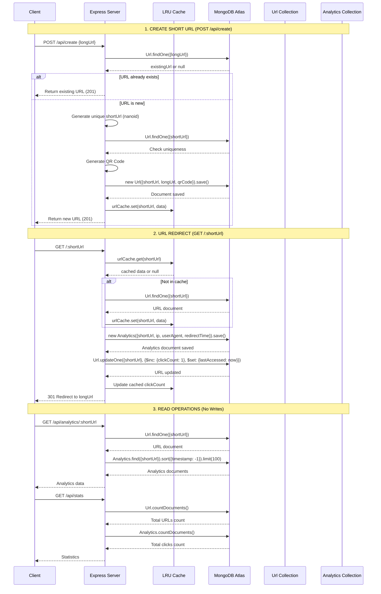

# MongoDB Write Operations UML - URL Shortener

## Sequence Diagram: MongoDB Writes



## Database Schema

### Url Collection
```javascript
{
  shortUrl: String (unique, required),
  longUrl: String (required),
  createdAt: Date (default: Date.now),
  clickCount: Number (default: 0),
  lastAccessed: Date,
  qrCode: String (base64 QR code)
}
```

### Analytics Collection
```javascript
{
  shortUrl: String (required),
  timestamp: Date (default: Date.now),
  ip: String,
  userAgent: String,
  redirectTime: Number (milliseconds)
}
```

## Write Operations Summary

### 1. URL Creation (POST /api/create)
- **Write**: `Url.save()` - Creates new URL document
- **Condition**: Only if URL doesn't already exist
- **Data**: shortUrl, longUrl, qrCode, createdAt

### 2. URL Redirect (GET /:shortUrl)
- **Write 1**: `Analytics.save()` - Creates analytics record
- **Write 2**: `Url.updateOne()` - Increments clickCount, updates lastAccessed
- **Condition**: Every time a short URL is accessed
- **Data**: Analytics (shortUrl, ip, userAgent, redirectTime, timestamp)
- **Data**: URL update (clickCount++, lastAccessed)

### 3. Read Operations (No Writes)
- GET /api/analytics/:shortUrl - Reads analytics data
- GET /api/stats - Reads aggregated statistics
- GET /api/urls - Reads URL list

## Performance Optimizations

1. **LRU Cache**: Reduces database reads for frequently accessed URLs
2. **Indexes**: MongoDB automatically indexes unique fields (shortUrl)
3. **Batch Operations**: Analytics writes are individual but fast
4. **Connection Pooling**: Mongoose handles connection management
